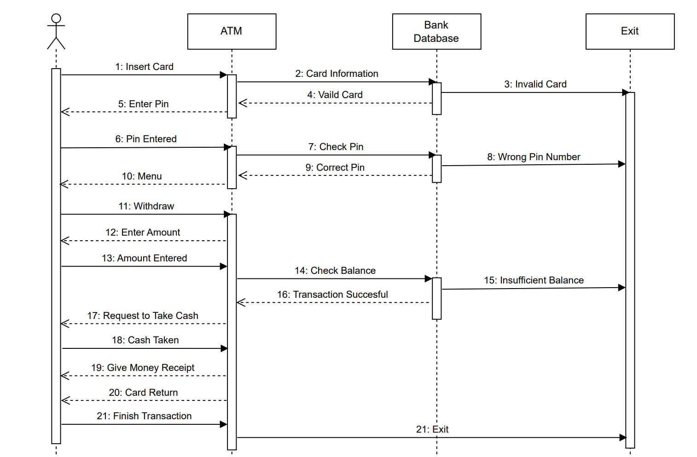

# Introduction:
The proposed ATM (Automated Teller Machine) system aims to provide a secure and efficient means for bank customers to perform various banking transactions, including withdrawals, deposits, balance inquiries, fund transfers, and more. This system is designed to enhance the convenience and accessibility of banking services for customers while maintaining the security of their financial information.

# UML Sequence Diagram:
A UML sequence diagram for an ATM system typically depicts interactions between actors (such as the user and the ATM) and the various components of the system. It shows how messages and requests are exchanged during different transactions.

Fig: ATM Sequence Diagram 

Below is a simplified description of the operating process of a UML sequence diagram for the proposed ATM Machine:

## 1. User Authentication:

    •	The user inserts their bank card into the ATM.
    •	The ATM reads the card and prompts the user to enter their PIN.
    •	The user enters the PIN.

## 2. User Validation:

    •	The ATM sends the entered PIN to the bank's server for validation.
    •	The bank's server verifies the PIN.
    •	If the PIN is valid, the server sends an acknowledgment message to the ATM. Otherwise it exits.

## 3. Transaction Selection:

    •	The ATM displays a menu of available transactions (e.g., withdrawal, deposit, balance inquiry).
    •	The user selects a transaction.

## 4.Transaction Processing:

    •	Depending on the selected transaction, the ATM communicates with the bank's server to perform the transaction.
    •	For example, in the sequence diagram cash withdrawal is shown where the ATM sends a request to the server to debit the user's account and dispense cash.
    •	The server processes the request and if the amount is sufficient then it updates the account balance, and sends a confirmation message to the ATM. Otherwise , it exits.

## 5. Transaction Completion:

    •	The ATM completes the requested transaction. For example, for withdrawal  the ATM dispenses cash.
    •	A transaction receipt is printed and provided to the user.
    •	The ATM returns the user's bank card and exits.

# Remarks:
The proposed ATM system offers a user-friendly and secure interface for customers to access their bank accounts and perform various financial transactions. It ensures the privacy and security of user information through PIN validation and secure communication with the bank's server. The system is designed to be efficient, providing a seamless banking experience for users.
